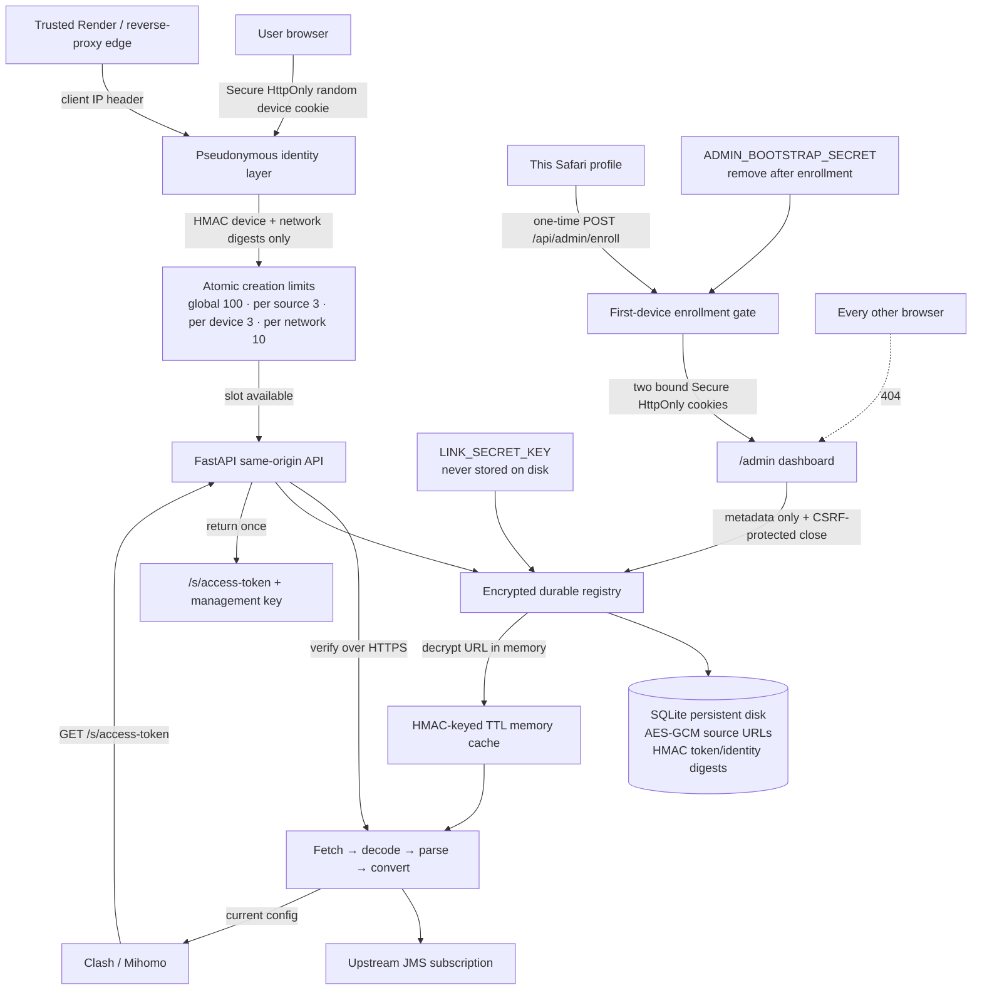
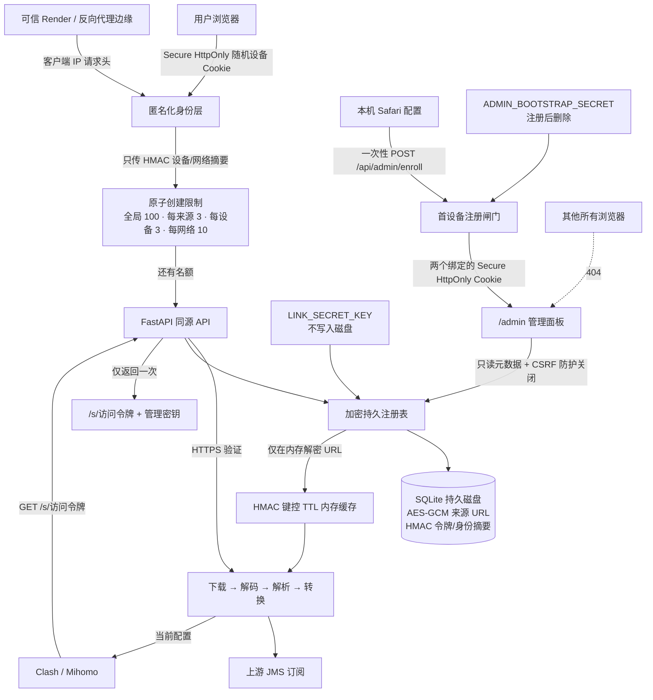

# JustMySockets-to-ClashMi

> Just My Socks can't provide a correct format for Clash Mi — this tool transforms it.
>
> Just My Socks 无法为 Clash Mi 提供正确的格式 —— 本工具负责转换。

[English](#english) · [中文](#中文)

---

# English

A **production-ready** service that accepts a Just My Socks (or any generic) proxy
subscription — a Base64 blob, a single `ss://` link, or a mixed list of
`ss://`, `vmess://`, `vless://`, `trojan://`, `hysteria2://`, `tuic://` links —
and converts it into a **fully compatible Mihomo / Clash Meta YAML**
configuration. The result is exposed through an HTTP endpoint that Clash Mi
(and Clash Verge, OpenClash, etc.) can subscribe to directly.

> **Why is this needed?** Just My Socks hands out a subscription in a format
> Clash Mi doesn't understand. This service downloads that subscription,
> decodes every node, and re-emits a clean Clash YAML on the fly. Your Clash
> client only ever talks to this converter — never the upstream provider.

---

## Part 1 — Quick Start

The fastest durable setup uses Docker plus the named volume already declared in
`docker-compose.yml`.

```bash
# 1. Clone
git clone https://github.com/JunWeiLi233/JustMySockets-to-ClashMi.git
cd JustMySockets-to-ClashMi

# 2. Generate the encryption key once, then save it in a private .env file
python3 -c 'import base64,secrets; print(base64.urlsafe_b64encode(secrets.token_bytes(32)).decode())'

# Generate a separate one-time admin enrollment secret
python3 -c 'import secrets; print(secrets.token_urlsafe(32))'

# .env (replace the placeholder; never commit this file or regenerate the key)
PERSISTENT_LINKS_ENABLED=true
LINK_SECRET_KEY=PASTE_THE_GENERATED_KEY
PUBLIC_BASE_URL=http://localhost:8000
ADMIN_BOOTSTRAP_SECRET=PASTE_THE_ONE_TIME_ADMIN_SECRET

# 3. Build & run
docker compose up -d --build
```

The service now listens on `http://localhost:8000`. Open that address in a
browser, paste the original subscription link, and click **Create permanent
link**. Save both values shown exactly once:

- The opaque subscription URL goes into Clash Mi.
- The separate management key permanently closes the link later.

The stable URL has the form `https://your-service.example/s/<random-token>` and
does not expose the original JMS credential. It has no automatic expiry and
keeps refreshing while this service, its durable storage, and the upstream
provider remain active.

To enroll the admin, open `http://localhost:8000/admin/enroll` in the Safari
profile you want to trust and submit the one-time admin secret. The first
successful browser is the only enrolled admin. Remove
`ADMIN_BOOTSTRAP_SECRET` from the environment and restart after enrollment;
normal admin access does not need it.

---

## Part 2 — Installation (without Docker)

If you want to run it directly with Python, follow these steps in order.

### 2.1 Requirements

- **Python 3.12** or newer (3.13 also works). Check yours:
  ```bash
  python3 --version   # must be >= 3.12
  ```
- **pip** (bundled with Python).
- *(Optional)* **Git** to clone the repo.

### 2.2 Step-by-step

```bash
# 1. Get the code
git clone https://github.com/JunWeiLi233/JustMySockets-to-ClashMi.git
cd JustMySockets-to-ClashMi

# 2. Create and activate a virtual environment (keeps your system Python clean)
python3.12 -m venv .venv
source .venv/bin/activate          # on Windows: .venv\Scripts\activate

# 3. Install ALL required Python packages
pip install -r requirements.txt
```

> **What does `requirements.txt` contain?** It pins the runtime dependencies:
> `fastapi` (the web framework), `uvicorn` (the ASGI server), `httpx` (HTTP
> client used to download the upstream subscription), `pydantic` (data
> validation for proxy nodes), `PyYAML` (to emit the Clash YAML), and
> `cryptography` (AES-GCM durable storage). After
> this step you have everything needed to run the service.

```bash
# 4. Run it
uvicorn subscription_converter.app:app --host 0.0.0.0 --port 8000
```

You should see `Uvicorn running on http://0.0.0.0:8000`. Open
`http://localhost:8000/` in a browser to use the private link builder.

### 2.3 (Optional) Development dependencies

If you plan to develop or run the test suite, also install the dev tools:

```bash
pip install -r requirements-dev.txt
```

This adds `pytest` + `pytest-asyncio` + `httpx2` (testing), `respx` (HTTP mocking),
`ruff` (linter/formatter), `mypy` (type checker), `pip-audit` (dependency security),
and `pre-commit` (git hooks).

---

## Part 3 — How It Works

Understanding the pipeline helps you debug and extend the service.



The access token and management key take separate paths: an access token can
only retrieve the rendered configuration, while the management key can only
delete its registry record. Neither token reveals the encrypted upstream URL.

### 3.1 Durable link registry

- Access and management tokens are independent 256-bit random values.
- Only HMAC-SHA256 token digests are stored; plaintext bearer tokens are not.
- Original upstream URLs are encrypted with AES-256-GCM before SQLite writes.
- Create uses an atomic transaction, so concurrent requests cannot exceed
  global, per-source, per-device, or per-network limits.
- A 256-bit random Secure/HttpOnly cookie is the primary user identifier. Only
  its keyed HMAC is persisted. IP addresses are secondary abuse signals; only
  keyed HMACs are stored, never raw addresses.
- Closing with the management key hard-deletes the record and immediately frees
  one slot. There is no background expiry job.

### 3.2 Admin browser

- `/admin/enroll` accepts the bootstrap secret once in a POST body. The first
  successful browser profile becomes the only admin; every other browser gets
  a 404 from the admin page and APIs.
- Admin authentication requires both a random admin cookie and the device
  cookie it was enrolled with. Both are `Secure`, `HttpOnly`, and
  `SameSite=Strict`; destructive requests additionally require a derived CSRF
  token.
- The dashboard receives only counts, timestamps, formats, and short
  pseudonymous references. It never receives upstream URLs, proxy credentials,
  access tokens, or management keys.
- This is browser-profile binding, not immutable hardware attestation. A stolen
  pair of cookies remains a bearer credential. For stronger hardware-backed
  identity, add WebAuthn or mutual TLS.

If Safari site data is deleted, admin access intentionally fails closed. To
recover, stop the service, back up the database, delete the single
`admin_device` row from SQLite using server-side access, set a newly generated
bootstrap secret, restart, and enroll Safari again. Never add a public “reset
admin” endpoint.

### 3.3 Parser (input side)

The parser is **provider-independent** — it doesn't care who published the
subscription. It:

1. **Downloads** the subscription body over HTTP (via `httpx`).
2. **Detects the format**: a plain list of links, a single link, or a Base64
   blob. Base64 is decoded automatically (padding/urlsafe tolerant).
3. **Parses each link** into a normalized `ProxyNode`. Supported schemes:
   - `ss://` — Shadowsocks (SIP002 + legacy; `obfs-local` → `obfs`)
   - `ssr://` — ShadowsocksR
   - `vmess://` — VMess (v2rayN JSON; ws/grpc/h2 transport)
   - `vless://` — VLESS (incl. REALITY: public-key/short-id/fingerprint/flow)
   - `trojan://` — Trojan (ws/grpc)
   - `hysteria2://` / `hy2://` — Hysteria2 (salamander obfs + bandwidth)
   - `hysteria://` — Hysteria v1
   - `tuic://` — TUIC v5
4. **Returns** a `Subscription` (the list of nodes + safe upstream metadata).

### 3.4 Converter (output side)

The converter turns the list of `ProxyNode`s into the target format. The
**Mihomo converter** generates:

- A `proxies:` block — one entry per node, using field names that match the
  official Mihomo documentation (`servername`, `client-fingerprint`,
  `reality-opts`, `ws-opts`, etc.).
- A `proxy-groups:` block with:
  - **`AUTO`** (`url-test`) — automatically picks the fastest node.
  - **`SELECT`** (`select`) — manual choice; includes `AUTO`, `DIRECT`, and all nodes.
- A `rules:` block with `MATCH,SELECT` (everything goes through the SELECT group).
- A `dns:` block (fake-ip mode, public resolvers).

> Surge and sing-box converters are also wired up (`/surge`, `/sing-box`) and
> share the same parser — they're intentionally minimal placeholders for now.

### 3.5 Dynamic updates ("always fresh")

This is the key production behavior:

- The **cache stores the parsed nodes**, not the rendered YAML.
- The YAML is **regenerated on every request** — so it always reflects the
  current upstream subscription and the current settings.
- The upstream is **re-downloaded automatically** every `CACHE_TTL_SECONDS`
  (default 300s = 5 minutes). When Just My Socks rotates servers, your config
  updates automatically within 5 minutes.
- `?force_refresh=true` forces an immediate re-download (e.g. after a known rotation).
- The `X-Subscription-Fetched-At` response header tells you when the upstream
  was last fetched.
- **No proxy server IP is ever hardcoded** — every node comes from the upstream.

---

## Part 4 — Endpoints

| Method | Path        | Description                              | Content-Type       |
|--------|-------------|------------------------------------------|--------------------|
| GET    | `/`                  | Create/manage browser interface                     | `text/html` |
| GET    | `/health`            | Health, cache, and durable-store readiness           | `application/json` |
| GET    | `/api/capacity`      | Active limit and remaining creation slots            | `application/json` |
| POST   | `/api/check`         | Test without storing                                 | `application/json` |
| POST   | `/api/links`         | Verify and create an encrypted permanent link        | `application/json` |
| POST   | `/api/links/close`   | Permanently close using a management key in the body | `application/json` |
| GET    | `/admin/enroll`      | One-time first-browser admin enrollment              | `text/html` |
| GET    | `/admin`             | Enrolled-browser metadata dashboard                  | `text/html` |
| GET    | `/api/admin/overview`| Pseudonymous admin metrics and link references       | `application/json` |
| POST   | `/api/admin/links/close` | CSRF-protected admin close by non-bearer reference | `application/json` |
| GET    | `/s/{access_token}`  | Current config for one durable link                  | format-specific |
| GET    | `/clash`, `/surge`, `/sing-box` | Legacy raw-URL endpoints (optional)         | format-specific |
| GET    | `/docs`              | Swagger UI when `ENABLE_DOCS=true`                   | `text/html` |

The UI is the supported creation flow. It verifies the upstream before storing,
returns the management key only in the `no-store` creation response, and never
puts that key in a URL. Legacy conversion endpoints can be disabled with
`ALLOW_LEGACY_URL_ENDPOINTS=false` after users migrate.

Legacy endpoints (`/clash`, `/surge`, `/sing-box`) take:

- **`?url=<subscription URL>`** (required, URL-encoded)
- **`&force_refresh=true`** (optional) — bypass the cache and re-download now.

**Example:**

```bash
# Get a Clash YAML config
curl "http://localhost:8000/clash?url=https%3A%2F%2Fjmssub.net%2Fgetsub.php%3Fsid%3D1%26token%3Dabc"

# Force a fresh download (bypass 5-min cache)
curl "http://localhost:8000/clash?url=https%3A%2F%2F...&force_refresh=true"

# Check service health
curl http://localhost:8000/health
# {"status":"ok","cache_size":0}
```

---

## Part 5 — Configuration

All settings are **environment variables**. You can set them before running
`uvicorn`, or in `docker-compose.yml` if using Docker.

| Variable                  | Default                              | Explanation                                                            |
|---------------------------|--------------------------------------|------------------------------------------------------------------------|
| `HOST`                    | `0.0.0.0`                            | Network interface to bind. `0.0.0.0` = all interfaces.                 |
| `PORT`                    | `8000`                               | TCP port to listen on.                                                 |
| `WORKERS`                 | `2`                                  | Number of Uvicorn worker processes (more = more concurrent requests).   |
| `CACHE_TTL_SECONDS`       | `300`                                | How often (seconds) the upstream subscription is re-downloaded. 300 = 5 min. |
| `CACHE_MAX_ENTRIES`       | `512`                                | Max distinct subscription URLs kept in the cache.                       |
| `FETCH_TIMEOUT_SECONDS`   | `15`                                 | Timeout (seconds) for downloading the upstream subscription.            |
| `FETCH_USER_AGENT`        | `clash.meta/1.18`                    | User-Agent sent to the upstream provider (some providers need this).    |
| `TEST_URL`                | `https://www.gstatic.com/generate_204` | URL used by the `AUTO` group to test node latency.                   |
| `TEST_INTERVAL`           | `300`                                | How often (seconds) the `AUTO` group re-tests node latency.             |
| `DNS_NAMESERVER`          | Ali/DoH Pub                          | Primary DNS resolvers (comma-separated). **These are public resolvers, not proxy servers.** |
| `DNS_FALLBACK`            | Cloudflare/Google DoH                | Fallback DNS resolvers (comma-separated).                              |
| `DNS_BOOTSTRAP`           | `223.5.5.5,119.29.29.29`             | Plain-DNS bootstrap resolvers.                                         |
| `DNS_FAKE_IP_RANGE`       | `198.18.0.1/16`                      | fake-ip CIDR range for the generated DNS block.                        |
| `DNS_IPV6`                | `false`                              | Enable IPv6 DNS in the generated config.                               |
| `LOG_LEVEL`               | `INFO`                               | Logging verbosity (`DEBUG`/`INFO`/`WARNING`/`ERROR`).                  |
| `ENABLE_DOCS`             | `false`                              | Expose Swagger/OpenAPI docs. Disabled by default to reduce public attack surface. |
| `ALLOWED_HOSTS`           | *(empty = all allowed)*              | Comma-separated allow-list of upstream hostnames (SSRF defence).        |
| `PERSISTENT_LINKS_ENABLED`| `false`                              | Enable encrypted permanent links; startup fails closed if required settings are unsafe. |
| `LINK_DATABASE_PATH`      | `/var/data/subscriptions.sqlite3`    | SQLite file; this directory **must** be a durable volume in production. |
| `LINK_SECRET_KEY`         | *(required when enabled)*            | URL-safe base64 encoding of exactly 32 random bytes. Never rotate or lose it while records exist. |
| `PUBLIC_BASE_URL`         | *(required when enabled)*            | Canonical HTTPS origin used in generated links. Local HTTP is accepted only for localhost. |
| `MAX_ACTIVE_LINKS`        | `100`                                | Atomic global creation cap. Existing links continue working when full. |
| `MAX_LINKS_PER_SOURCE`    | `3`                                  | Maximum links for the same upstream URL and output format.             |
| `MAX_LINKS_PER_USER`      | `3`                                  | Maximum active links owned by one pseudonymous browser device.         |
| `MAX_LINKS_PER_NETWORK`   | `10`                                 | Secondary active-link ceiling for one HMAC-pseudonymised client IP.    |
| `TRUSTED_CLIENT_IP_HEADER`| *(empty)*                            | Client-IP header supplied by a trusted edge. Never enable for a caller-controlled header. |
| `ADMIN_BOOTSTRAP_SECRET`  | *(empty)*                            | One-time 43-character enrollment token. Remove it after the first admin browser enrolls. |
| `CHECK_RATE_LIMIT` / `CHECK_RATE_WINDOW_SECONDS` | `30` / `60` | Per-device and per-network connection-check limit/window. |
| `CREATE_RATE_LIMIT` / `CREATE_RATE_WINDOW_SECONDS` | `5` / `3600` | Per-device and per-network creation-attempt limit/window. |
| `CLOSE_RATE_LIMIT` / `CLOSE_RATE_WINDOW_SECONDS` | `20` / `60` | Per-device and per-network close-attempt limit/window. |
| `ALLOW_LEGACY_URL_ENDPOINTS` | `true`                           | Keep or disable raw `?url=` endpoints after migration.                 |

**Example — set a config via environment variables (no Docker):**

```bash
export PORT=9000
export CACHE_TTL_SECONDS=120
uvicorn subscription_converter.app:app --host 0.0.0.0 --port 9000
```

---

## Part 6 — Security

This service is designed to handle sensitive data (subscription URLs contain
credentials). Key safeguards:

- **Subscription URLs and passwords are NEVER logged.** A process-wide logging
  filter redacts any `url=...` value before it reaches any log handler.
- **The browser UI has no analytics or third-party assets.** It stores no
  subscription URL in browser storage. One random HttpOnly device cookie is
  used for fair-use quotas, and only its HMAC digest is persisted.
- **Durable source URLs use AES-256-GCM authenticated encryption.** The database
  stores only ciphertext plus HMAC digests of access/management tokens. The
  management key is returned once and never placed in request URLs.
- **Rendered configurations are `private, no-store`.** Shared caches, CDNs, and
  browser caches are instructed not to retain proxy credentials.
- **Cache lookup keys are HMAC digests**, never raw URLs. Parsed proxy nodes are
  held only in process memory until TTL expiry; only the encrypted upstream URL
  is durable.
- **Strict browser headers** enforce a nonce-based CSP, no referrers, no framing,
  no MIME sniffing, and no access to camera/location/microphone APIs.
- **Admin is deny-by-default and one-browser enrolled.** Unauthenticated admin
  routes return 404; the UI exposes only pseudonymous metadata; mutations are
  same-origin and CSRF protected.
- **The Docker container runs as a non-root user** (uid 1001).
- **`ALLOWED_HOSTS`** restricts which upstream providers may be contacted
  (defence-in-depth against SSRF via the `?url=` parameter).

> A generated subscription URL is still a bearer credential: anyone who obtains
> it can download that config. Keep both it and the more-powerful management key
> private. No system can guarantee literal forever availability; service billing,
> storage/key retention, domain continuity, and the upstream provider all matter.

---

## Part 7 — Deployment

### 7.1 VPS (with Docker)

```bash
git clone https://github.com/JunWeiLi233/JustMySockets-to-ClashMi.git
cd JustMySockets-to-ClashMi
docker compose up -d --build
```

Put it behind a reverse proxy with HTTPS. Example **Caddyfile** (automatic HTTPS):

```caddyfile
converter.yourdomain.com {
    reverse_proxy 127.0.0.1:8000
}
```

### 7.2 Render durable deployment

Render filesystems are ephemeral unless a persistent disk is attached. For the
permanent-link feature:

1. Use a paid web service and attach the smallest persistent disk at `/var/data`.
2. Set `PERSISTENT_LINKS_ENABLED=true`, `LINK_DATABASE_PATH=/var/data/subscriptions.sqlite3`,
   a generated `LINK_SECRET_KEY`, the canonical `PUBLIC_BASE_URL`, conservative
   link limits, and `TRUSTED_CLIENT_IP_HEADER=X-Forwarded-For`.
3. Keep one service instance (`WORKERS=1` is recommended on the Starter plan).
4. Back up the encryption key separately. Render disk snapshots cannot decrypt
   records without it.
5. Temporarily set a separately generated `ADMIN_BOOTSTRAP_SECRET`, deploy, then
   open `/admin/enroll` in the Safari profile on this computer. Remove that
   environment variable and redeploy immediately after successful enrollment.
6. Set `ALLOW_LEGACY_URL_ENDPOINTS=false` after any raw-URL subscribers have
   migrated to opaque `/s/` links, so upstream credentials never appear in
   request URLs or edge logs.

Render currently lists Starter compute at $7/month and persistent SSD storage at
$0.25/GB/month, so a 1 GB disk is approximately $7.25/month before bandwidth.
See the official [persistent disk documentation](https://render.com/docs/disks)
and [pricing](https://render.com/pricing). A disk prevents horizontal scaling;
migrate the store to managed Postgres before moving to multiple instances.

### 7.3 Cloudflare Tunnel

Run the converter on a machine that's **not** publicly reachable, then expose
it through Cloudflare Tunnel for free TLS + DDoS protection:

```bash
cloudflared tunnel create converter
cloudflared tunnel route dns converter converter.yourdomain.com
cloudflared tunnel run --url http://localhost:8000 converter
```

Optionally add **Cloudflare Access** in front for authentication.

---

## Part 8 — Development

```bash
# Install runtime + dev dependencies
pip install -r requirements-dev.txt

# Install git hooks
pre-commit install

# Run all quality gates
ruff check subscription-converter
ruff format --check subscription-converter
mypy subscription-converter/subscription_converter
pytest
```

Python 3.12 is the runtime target; CI also tests 3.13 for forward-compatibility.

### Project layout

```
subscription-converter/
├── subscription_converter/         # the importable Python package
│   ├── models.py                   # Pydantic domain models (ProxyNode, etc.)
│   ├── parser_port.py              # parser Protocol interface + registry
│   ├── parsers/                    # per-protocol URI parsers (ss, vmess, ...)
│   ├── subscription_parser.py      # fetch + decode + parse orchestrator
│   ├── converters/                 # output renderers (mihomo, surge, sing-box)
│   ├── converter_registry.py       # output format registry
│   ├── cache.py                    # HMAC-keyed TTL cache
│   ├── rate_limit.py               # ephemeral pseudonymous request limiter
│   ├── link_store.py               # encrypted durable-link registry
│   ├── admin_frontend.py           # enrolled-browser admin UI
│   ├── config.py                   # immutable Settings (env-driven)
│   └── app.py                      # FastAPI app + endpoints
└── tests/                          # pytest suite (174 tests)
```

---

## License

MIT.

---

# 中文

一个**生产级**服务：接收 Just My Socks(或任意通用)代理订阅 —— 可以是 Base64
数据块、单条 `ss://` 链接,或 `ss://`、`vmess://`、`vless://`、`trojan://`、
`hysteria2://`、`tuic://` 混合列表 —— 将其转换为**完全兼容的 Mihomo / Clash
Meta YAML 配置**,并通过 HTTP 接口对外提供,让 Clash Mi(以及 Clash Verge、
OpenClash 等)直接订阅。

> **为什么需要这个工具?** Just My Socks 提供的订阅格式 Clash Mi 无法识别。本
> 服务会下载该订阅、解码每个节点,并即时重新生成一份干净的 Clash YAML。你的
> Clash 客户端只需要订阅本转换器,完全不需要直接对接上游。

---

## 第 1 部分 —— 快速开始

最快的持久化方式:使用 Docker 和 `docker-compose.yml` 中已经声明的命名卷。

```bash
# 1. 克隆
git clone https://github.com/JunWeiLi233/JustMySockets-to-ClashMi.git
cd JustMySockets-to-ClashMi

# 2. 只生成一次加密密钥,并保存到私有 .env 文件
python3 -c 'import base64,secrets; print(base64.urlsafe_b64encode(secrets.token_bytes(32)).decode())'

# 另行生成一次性管理员注册密钥
python3 -c 'import secrets; print(secrets.token_urlsafe(32))'

# .env(替换占位符;不要提交该文件,有记录后不要重新生成密钥)
PERSISTENT_LINKS_ENABLED=true
LINK_SECRET_KEY=粘贴刚才生成的密钥
PUBLIC_BASE_URL=http://localhost:8000
ADMIN_BOOTSTRAP_SECRET=粘贴一次性管理员密钥

# 3. 构建并运行
docker compose up -d --build
```

服务现在监听 `http://localhost:8000`。用浏览器打开此地址,粘贴原始订阅地址,
点击 **Create permanent link**。页面只显示一次两个值:

- 把不透明的订阅 URL 加入 Clash Mi。
- 单独保存管理密钥,以后用它永久关闭该链接。

稳定地址形如 `https://你的服务/s/<随机令牌>`,不会暴露原始 JMS 凭据。它不
自动过期;只要本服务、持久磁盘和上游供应商都保持可用,客户端就会持续刷新。

管理员注册:请在要授权的 Safari 浏览器配置中打开
`http://localhost:8000/admin/enroll`,提交一次性管理员密钥。第一个成功注册的
浏览器是唯一管理员。注册完成后从环境变量中删除 `ADMIN_BOOTSTRAP_SECRET` 并
重启;日常管理不再需要这个一次性密钥。

---

## 第 2 部分 —— 安装(不用 Docker)

如果你想直接用 Python 运行,请按顺序执行以下步骤。

### 2.1 环境要求

- **Python 3.12** 或更高版本(3.13 也可以)。检查版本:
  ```bash
  python3 --version   # 必须 >= 3.12
  ```
- **pip**(随 Python 自带)。
- *(可选)* **Git** 用于克隆代码。

### 2.2 分步操作

```bash
# 1. 获取代码
git clone https://github.com/JunWeiLi233/JustMySockets-to-ClashMi.git
cd JustMySockets-to-ClashMi

# 2. 创建并激活虚拟环境(避免污染系统 Python)
python3.12 -m venv .venv
source .venv/bin/activate          # Windows 用: .venv\Scripts\activate

# 3. 安装所有必需的 Python 包
pip install -r requirements.txt
```

> **`requirements.txt` 里有什么?** 它固定了运行时依赖:`fastapi`(Web 框架)、
> `uvicorn`(ASGI 服务器)、`httpx`(用于下载上游订阅的 HTTP 客户端)、
> `pydantic`(代理节点的数据校验)、`PyYAML`(生成 Clash YAML)和
> `cryptography`(AES-GCM 持久存储)。执行完这一步,
> 你就拥有运行本服务所需的全部依赖。

```bash
# 4. 运行
uvicorn subscription_converter.app:app --host 0.0.0.0 --port 8000
```

你会看到 `Uvicorn running on http://0.0.0.0:8000`。用浏览器打开
`http://localhost:8000/` 即可使用私密订阅地址生成界面。

### 2.3 (可选)开发依赖

如果你要开发或跑测试,还要安装开发工具:

```bash
pip install -r requirements-dev.txt
```

这会额外安装 `pytest` + `pytest-asyncio` + `httpx2`(测试)、`respx`(HTTP 模拟)、
`ruff`(代码检查/格式化)、`mypy`(类型检查)、`pip-audit`(依赖安全审计)和
`pre-commit`(Git 钩子)。

---

## 第 3 部分 —— 工作原理

理解这条流水线有助于排查问题和扩展功能。



访问令牌和管理密钥走两条相互独立的路径：访问令牌只能读取生成后的配置，管理
密钥只能删除对应的注册记录；两者都不会暴露加密保存的上游 URL。

### 3.1 持久链接注册表

- 访问令牌和管理密钥是两个独立的 256 位随机值。
- 磁盘只保存令牌的 HMAC-SHA256 摘要,不保存明文令牌。
- 原始上游 URL 在写入 SQLite 前使用 AES-256-GCM 认证加密。
- 创建使用原子事务,并发请求无法突破全局、每来源、每设备和每网络上限。
- 主要用户标识是 256 位随机的 Secure/HttpOnly Cookie;持久化的只有键控 HMAC。
  IP 地址只是次要滥用信号,也只保存 HMAC,绝不保存原始地址。
- 使用管理密钥关闭后会硬删除记录并立即释放名额;没有后台自动过期。

### 3.2 管理员浏览器

- `/admin/enroll` 只在第一次接受请求体中的一次性密钥。第一个成功注册的浏览器
  配置是唯一管理员;其余浏览器访问管理页面和 API 都得到 404。
- 管理认证同时要求管理员 Cookie 和当初绑定的设备 Cookie。两者都是 `Secure`、
  `HttpOnly`、`SameSite=Strict`;破坏性请求还要求派生的 CSRF 令牌。
- 面板只接收数量、时间、格式和短匿名引用;永远不接收上游 URL、代理凭据、访问
  令牌或管理密钥。
- 这是浏览器配置绑定,不是不可复制的硬件认证。如果两个 Cookie 同时被盗,仍可
  作为 bearer 凭据使用。需要硬件级保证时应增加 WebAuthn 或双向 TLS。

如果删除了 Safari 网站数据,管理员访问会按设计拒绝。恢复时应停止服务、备份
数据库、通过服务器端访问删除 SQLite 中唯一的 `admin_device` 记录,设置新生成的
一次性密钥,重启并重新注册 Safari。不要增加公开的“重置管理员”接口。

### 3.3 解析器(输入侧)

解析器**与供应商无关** —— 它不关心是谁发布的订阅。它会:

1. **下载**订阅内容(通过 `httpx`)。
2. **识别格式**:纯链接列表、单条链接,或 Base64 数据块。Base64 会自动解码
   (兼容缺失填充和 urlsafe 变体)。
3. **把每条链接解析**成标准化的 `ProxyNode`。支持的协议:
   - `ss://` —— Shadowsocks(SIP002 + 旧版;`obfs-local` → `obfs`)
   - `ssr://` —— ShadowsocksR
   - `vmess://` —— VMess(v2rayN JSON;ws/grpc/h2 传输)
   - `vless://` —— VLESS(含 REALITY:公钥/短ID/指纹/flow)
   - `trojan://` —— Trojan(ws/grpc)
   - `hysteria2://` / `hy2://` —— Hysteria2(salamander 混淆 + 带宽)
   - `hysteria://` —— Hysteria v1
   - `tuic://` —— TUIC v5
4. **返回**一个 `Subscription`(节点列表 + 安全的上游元数据)。

### 3.4 转换器(输出侧)

转换器把 `ProxyNode` 列表转换成目标格式。**Mihomo 转换器**会生成:

- `proxies:` 块 —— 每个节点一条,字段名严格遵循 Mihomo 官方文档
  (`servername`、`client-fingerprint`、`reality-opts`、`ws-opts` 等)。
- `proxy-groups:` 块,包含:
  - **`AUTO`**(`url-test`)—— 自动选择最快的节点。
  - **`SELECT`**(`select`)—— 手动选择;包含 `AUTO`、`DIRECT` 和所有节点。
- `rules:` 块,含 `MATCH,SELECT`(所有流量走 SELECT 组)。
- `dns:` 块(fake-ip 模式,公共解析器)。

> Surge 和 sing-box 转换器也已接好(`/surge`、`/sing-box`),共用同一个解析
> 器 —— 目前是刻意精简的占位实现。

### 3.4 动态更新("始终最新")

这是关键的生产级行为:

- **缓存里存的是解析后的节点**,不是渲染好的 YAML。
- YAML **每次请求都重新生成** —— 因此始终反映当前的上游订阅和当前设置。
- 上游**每 `CACHE_TTL_SECONDS`(默认 300 秒 = 5 分钟)自动重新下载**。当
  Just My Socks 轮换服务器时,你的配置会在 5 分钟内自动更新。
- `?force_refresh=true` 可强制立即重新下载(例如已知刚轮换过)。
- 响应头 `X-Subscription-Fetched-At` 告诉你上游上次下载的时间。
- **绝不硬编码任何代理服务器 IP** —— 每个节点都来自上游。

---

## 第 4 部分 —— 接口

| 方法 | 路径        | 说明                                    | Content-Type       |
|------|-------------|-----------------------------------------|--------------------|
| GET  | `/`                  | 创建/管理网页界面                         | `text/html` |
| GET  | `/health`            | 健康、缓存和持久存储状态                    | `application/json` |
| GET  | `/api/capacity`      | 活跃上限和剩余创建名额                      | `application/json` |
| POST | `/api/check`         | 测试但不保存                              | `application/json` |
| POST | `/api/links`         | 验证并创建加密的永久链接                    | `application/json` |
| POST | `/api/links/close`   | 用请求体中的管理密钥永久关闭                | `application/json` |
| GET  | `/admin/enroll`      | 仅一次的首个浏览器管理员注册                | `text/html` |
| GET  | `/admin`             | 已注册浏览器的匿名化管理面板                | `text/html` |
| GET  | `/api/admin/overview`| 匿名化指标和链接引用                        | `application/json` |
| POST | `/api/admin/links/close` | 用非 bearer 引用执行 CSRF 防护的关闭操作 | `application/json` |
| GET  | `/s/{access_token}`  | 一个持久链接的当前配置                      | 取决于格式 |
| GET  | `/clash`、`/surge`、`/sing-box` | 可选的旧式原始 URL 接口          | 取决于格式 |
| GET  | `/docs`              | `ENABLE_DOCS=true` 时的 Swagger UI         | `text/html` |

网页界面是推荐创建流程。它先验证上游,管理密钥只出现在 `no-store` 创建响应中,
绝不会放进 URL。所有用户迁移后,可用 `ALLOW_LEGACY_URL_ENDPOINTS=false` 关闭
旧接口。

旧转换接口(`/clash`、`/surge`、`/sing-box`)接受:

- **`?url=<订阅地址>`**(必填,需 URL 编码)
- **`&force_refresh=true`**(可选)—— 绕过缓存,立即重新下载。

**示例:**

```bash
# 获取 Clash YAML 配置
curl "http://localhost:8000/clash?url=https%3A%2F%2Fjmssub.net%2Fgetsub.php%3Fsid%3D1%26token%3Dabc"

# 强制刷新(绕过 5 分钟缓存)
curl "http://localhost:8000/clash?url=https%3A%2F%2F...&force_refresh=true"

# 检查服务健康
curl http://localhost:8000/health
# {"status":"ok","cache_size":0}
```

---

## 第 5 部分 —— 配置

所有设置都是**环境变量**。你可以在运行 `uvicorn` 前设置,或在使用 Docker 时
写在 `docker-compose.yml` 里。

| 变量                      | 默认值                               | 说明                                                    |
|---------------------------|--------------------------------------|---------------------------------------------------------|
| `HOST`                    | `0.0.0.0`                            | 绑定的网卡。`0.0.0.0` = 所有网卡。                       |
| `PORT`                    | `8000`                               | 监听的 TCP 端口。                                        |
| `WORKERS`                 | `2`                                  | Uvicorn worker 进程数(越多并发越高)。                   |
| `CACHE_TTL_SECONDS`       | `300`                                | 上游订阅多久(秒)重新下载一次。300 = 5 分钟。            |
| `CACHE_MAX_ENTRIES`       | `512`                                | 缓存中最多保留多少个不同的订阅地址。                     |
| `FETCH_TIMEOUT_SECONDS`   | `15`                                 | 下载上游订阅的超时时间(秒)。                            |
| `FETCH_USER_AGENT`        | `clash.meta/1.18`                    | 发送给上游的 User-Agent(部分供应商需要特定 UA)。        |
| `TEST_URL`                | `https://www.gstatic.com/generate_204` | `AUTO` 组测速用的地址。                              |
| `TEST_INTERVAL`           | `300`                                | `AUTO` 组多久(秒)重新测速一次。                        |
| `DNS_NAMESERVER`          | Ali/DoH Pub                          | 主 DNS 解析器(逗号分隔)。**这些是公共解析器,不是代理服务器。** |
| `DNS_FALLBACK`            | Cloudflare/Google DoH                | 备用 DNS 解析器(逗号分隔)。                             |
| `DNS_BOOTSTRAP`           | `223.5.5.5,119.29.29.29`             | 明文 DNS 引导解析器。                                    |
| `DNS_FAKE_IP_RANGE`       | `198.18.0.1/16`                      | 生成 DNS 块的 fake-ip CIDR 范围。                        |
| `DNS_IPV6`                | `false`                              | 是否在生成配置中启用 IPv6 DNS。                          |
| `LOG_LEVEL`               | `INFO`                               | 日志级别(`DEBUG`/`INFO`/`WARNING`/`ERROR`)。            |
| `ENABLE_DOCS`             | `false`                              | 是否公开 Swagger/OpenAPI 文档。默认关闭以缩小攻击面。    |
| `ALLOWED_HOSTS`           | *(空 = 全部允许)*                    | 允许的上游主机名白名单(逗号分隔,防 SSRF)。             |
| `PERSISTENT_LINKS_ENABLED`| `false`                              | 启用加密永久链接;设置不安全时启动会失败。               |
| `LINK_DATABASE_PATH`      | `/var/data/subscriptions.sqlite3`    | SQLite 文件;生产环境目录必须挂载持久卷。                |
| `LINK_SECRET_KEY`         | *(启用时必填)*                       | 32 个随机字节的 URL-safe Base64;有记录时不可丢失或轮换。 |
| `PUBLIC_BASE_URL`         | *(启用时必填)*                       | 生成链接使用的 HTTPS 规范域名;只有 localhost 可用 HTTP。 |
| `MAX_ACTIVE_LINKS`        | `100`                                | 原子全局创建上限;满额后已有链接继续工作。                |
| `MAX_LINKS_PER_SOURCE`    | `3`                                  | 同一上游 URL + 输出格式最多创建多少个链接。              |
| `MAX_LINKS_PER_USER`      | `3`                                  | 一个匿名化浏览器设备最多拥有的活跃链接数。               |
| `MAX_LINKS_PER_NETWORK`   | `10`                                 | 一个经过 HMAC 匿名化的客户端 IP 的次级活跃链接上限。     |
| `TRUSTED_CLIENT_IP_HEADER`| *(空)*                               | 可信边缘提供的客户端 IP 请求头;不得信任调用者可控制的头。 |
| `ADMIN_BOOTSTRAP_SECRET`  | *(空)*                               | 43 字符一次性注册令牌;首个管理员注册后立即删除。          |
| `CHECK_RATE_LIMIT` / `CHECK_RATE_WINDOW_SECONDS` | `30` / `60` | 每设备和每网络的测试次数/时间窗口。            |
| `CREATE_RATE_LIMIT` / `CREATE_RATE_WINDOW_SECONDS` | `5` / `3600` | 每设备和每网络的创建尝试次数/时间窗口。       |
| `CLOSE_RATE_LIMIT` / `CLOSE_RATE_WINDOW_SECONDS` | `20` / `60` | 每设备和每网络的关闭尝试次数/时间窗口。         |
| `ALLOW_LEGACY_URL_ENDPOINTS` | `true`                           | 迁移后是否关闭旧式 `?url=` 接口。                       |

**示例 —— 用环境变量配置(无 Docker):**

```bash
export PORT=9000
export CACHE_TTL_SECONDS=120
uvicorn subscription_converter.app:app --host 0.0.0.0 --port 9000
```

---

## 第 6 部分 —— 安全

本服务会处理敏感数据(订阅地址里含凭据)。关键防护措施:

- **订阅地址和密码绝不写入日志。** 进程级的日志过滤器会在任何日志处理器收到
  记录前,抹除所有 `url=...` 的值。
- **网页界面不包含分析或第三方资源。** 浏览器存储中不保存订阅 URL。仅使用一个
  随机 HttpOnly 设备 Cookie 实现公平限制,持久化的只有其 HMAC 摘要。
- **持久源 URL 使用 AES-256-GCM 认证加密。** 数据库只保存密文及访问/管理令牌
  的 HMAC 摘要。管理密钥仅返回一次,永远不放进请求 URL。
- **生成配置使用 `private, no-store`。** 共享缓存、CDN 和浏览器缓存不得保留
  代理凭据。
- **缓存查找键只存 URL 的 HMAC 摘要**,不存原始 URL。代理节点只在内存保留
  到 TTL 到期;持久化的只有加密后的上游 URL。
- **严格浏览器安全响应头**包含 nonce CSP、禁止 referrer、禁止 iframe、禁止
  MIME 猜测及禁用相机/定位/麦克风等权限。
- **管理员默认拒绝且只注册一个浏览器。** 未认证管理路由返回 404;页面只暴露
  匿名化元数据;修改操作要求同源和 CSRF 防护。
- **Docker 容器以非 root 用户运行**(uid 1001)。
- **`ALLOWED_HOSTS`** 限制可访问哪些上游供应商(防 SSRF 的纵深防御)。

> 生成的订阅 URL 仍是 bearer 凭据:拿到它的人可以下载配置。订阅 URL 和权限
> 更高的管理密钥都必须保密。任何系统都不能承诺字面意义上的永久可用;服务付
> 费、磁盘与密钥保留、域名和上游供应商都必须持续有效。

---

## 第 7 部分 —— 部署

### 7.1 VPS(用 Docker)

```bash
git clone https://github.com/JunWeiLi233/JustMySockets-to-ClashMi.git
cd JustMySockets-to-ClashMi
docker compose up -d --build
```

建议放在带 HTTPS 的反向代理后面。**Caddyfile** 示例(自动 HTTPS):

```caddyfile
converter.yourdomain.com {
    reverse_proxy 127.0.0.1:8000
}
```

### 7.2 Render 持久化部署

Render 默认文件系统是临时的。永久链接功能需要:

1. 使用付费 Web Service,并把最小的持久磁盘挂载到 `/var/data`。
2. 设置 `PERSISTENT_LINKS_ENABLED=true`、`LINK_DATABASE_PATH=/var/data/subscriptions.sqlite3`、
   一次性生成的 `LINK_SECRET_KEY`、规范 `PUBLIC_BASE_URL`、保守的链接上限和
   `TRUSTED_CLIENT_IP_HEADER=X-Forwarded-For`。
3. 保持一个服务实例(Starter 套餐建议 `WORKERS=1`)。
4. 单独备份加密密钥;只有磁盘快照、没有密钥也无法解密记录。
5. 临时设置另行生成的 `ADMIN_BOOTSTRAP_SECRET` 并部署,然后在本机 Safari 配置
   中打开 `/admin/enroll`。成功后立即删除该环境变量并重新部署。
6. 所有旧式原始 URL 订阅迁移到不透明 `/s/` 链接后,设置
   `ALLOW_LEGACY_URL_ENDPOINTS=false`,避免上游凭据进入请求 URL 或边缘日志。

Render 目前 Starter 计算为每月 7 美元,持久 SSD 为每 GB 每月 0.25 美元,因此
1 GB 磁盘约为每月 7.25 美元(不含额外带宽)。请查看官方
[持久磁盘文档](https://render.com/docs/disks)和[价格](https://render.com/pricing)。
挂载磁盘后不能横向扩容;需要多实例前应把存储迁移到托管 Postgres。

### 7.3 Cloudflare Tunnel

把转换器跑在**不**直接对公网开放的机器上,再通过 Cloudflare Tunnel 暴露,获得
免费的 TLS + DDoS 防护:

```bash
cloudflared tunnel create converter
cloudflared tunnel route dns converter converter.yourdomain.com
cloudflared tunnel run --url http://localhost:8000 converter
```

可选地,在前方加 **Cloudflare Access** 实现身份认证。

---

## 第 8 部分 —— 开发

```bash
# 安装运行时 + 开发依赖
pip install -r requirements-dev.txt

# 安装 Git 钩子
pre-commit install

# 运行所有质量检查
ruff check subscription-converter
ruff format --check subscription-converter
mypy subscription-converter/subscription_converter
pytest
```

运行时目标为 Python 3.12;CI 也会测试 3.13 以保证前向兼容。

### 项目结构

```
subscription-converter/
├── subscription_converter/         # 可导入的 Python 包
│   ├── models.py                   # Pydantic 领域模型(ProxyNode 等)
│   ├── parser_port.py              # 解析器 Protocol 接口 + 注册表
│   ├── parsers/                    # 各协议 URI 解析器(ss、vmess ...)
│   ├── subscription_parser.py      # 下载 + 解码 + 解析 编排器
│   ├── converters/                 # 输出渲染器(mihomo、surge、sing-box)
│   ├── converter_registry.py       # 输出格式注册表
│   ├── cache.py                    # HMAC 键控的 TTL 缓存
│   ├── rate_limit.py               # 临时匿名化请求限流器
│   ├── link_store.py               # 加密持久链接注册表
│   ├── admin_frontend.py           # 已注册浏览器的管理界面
│   ├── config.py                   # 不可变 Settings(环境变量驱动)
│   └── app.py                      # FastAPI 应用 + 接口
└── tests/                          # pytest 测试套件(174 个测试)
```

---

## 许可证

MIT。
